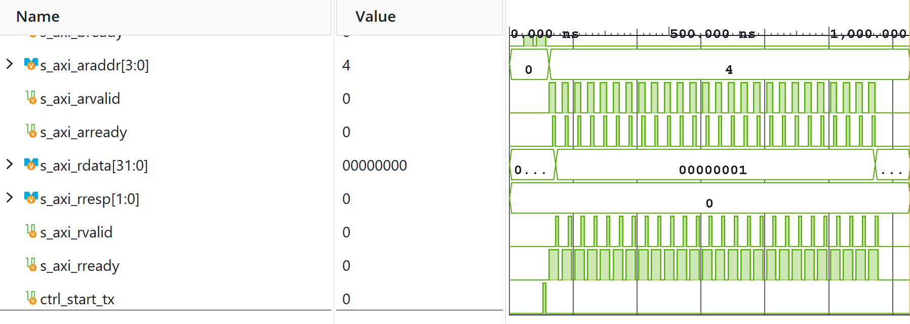

# AXI4-Lite Slave Register Interface

A 32-bit AXI4-Lite memory-mapped slave controller implementing standard ARM AXI4-Lite protocol specifications.

## Features
* Fully decoupled read/write address and data channels.
* Standard 2-bit response codes (`OKAY`, `DECERR`, etc.) on `BRESP` and `RRESP`.
* Support for byte-wide write strobes (`s_axi_wstrb`).
* Integrated hardware registers for control, status monitoring, and data payload transfers.

## Simulation Verification
* Tested using SystemVerilog testbench `tb/tb_axi_lite_slave.sv`.

