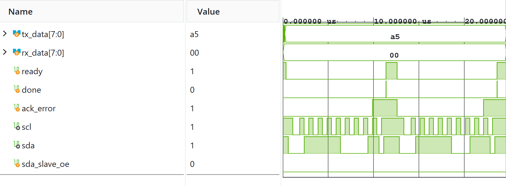

# I2C Master Controller

An Inter-Integrated Circuit (I2C) master interface implemented in SystemVerilog for single-master serial communication.

## Features
* Generates standard I2C start and stop conditions on `SCL` and `SDA`.
* Handles 7-bit slave addressing along with read/write control flags.
* Integrated ACK/NACK verification logic and arbitration status signaling.

## Simulation Verification
* Top module `i2c_master.sv` tested against `tb/tb_i2c_master.sv`.

