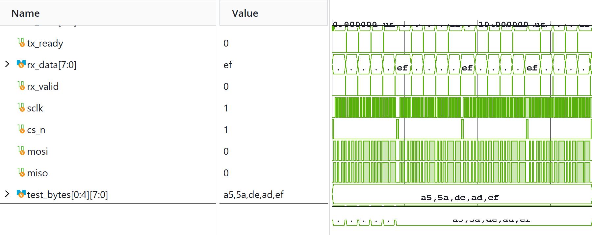

# SPI Master Controller

A parameterizable Serial Peripheral Interface (SPI) master controller written in SystemVerilog.

## Features
* Parameterized data word length (`DATA_WIDTH`) and clock division ratio.
* Mode 0 (CPOL = 0, CPHA = 0) operation with active-low Chip Select (`cs_n`).
* Simple handshake flags (`start`, `busy`, `done`).

## Simulation Verification
* Module `spi_master.sv` verified using `tb/tb_spi_master.sv`.

