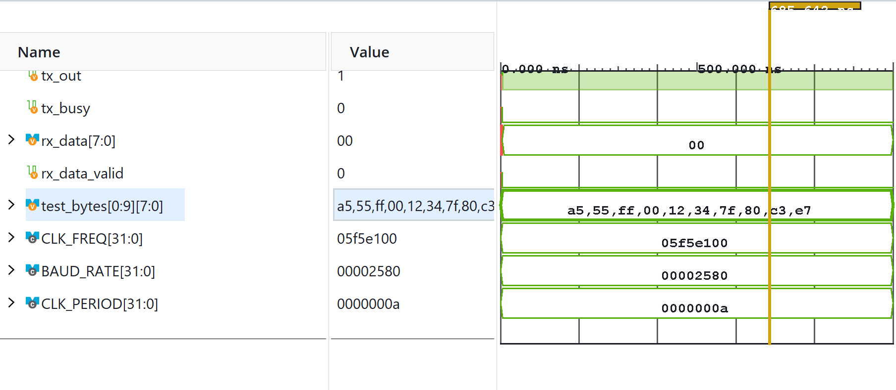
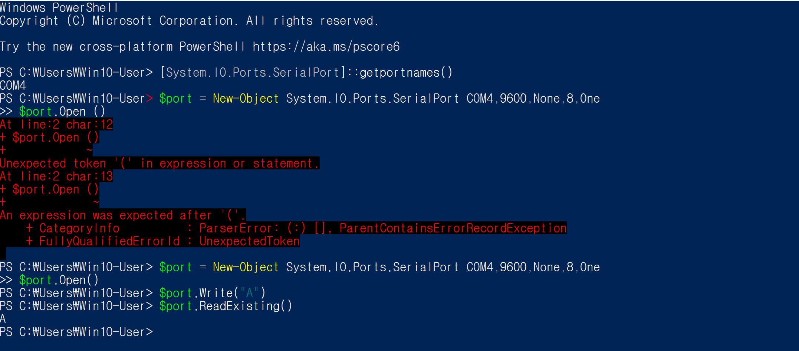
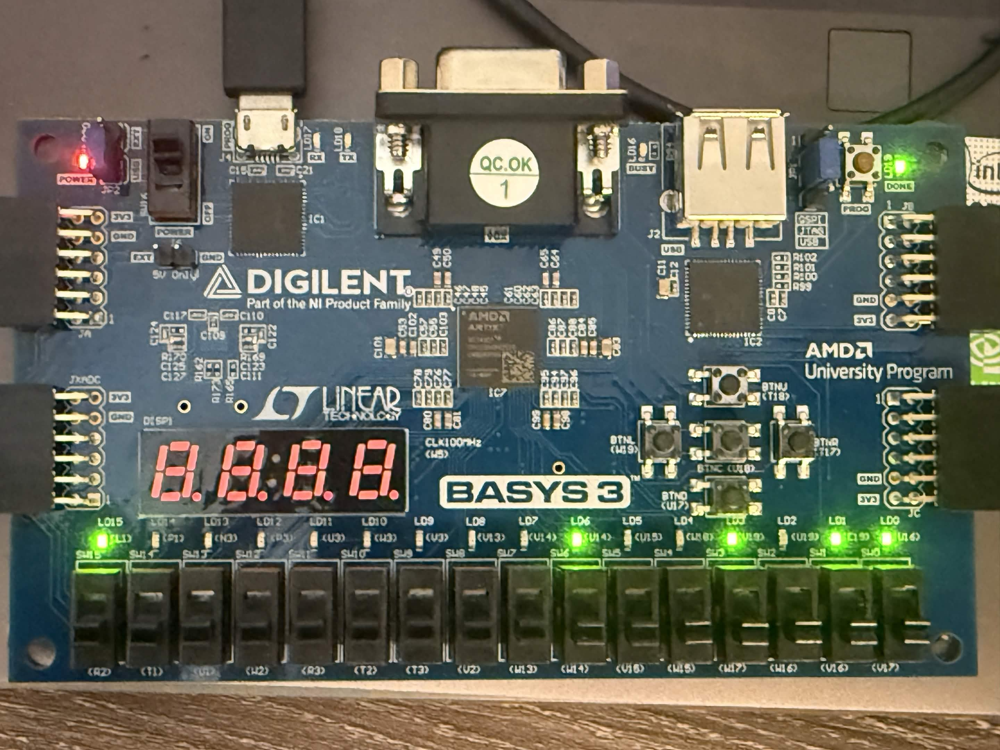

# UART Controller

A synchronous Universal Asynchronous Receiver-Transmitter (UART) core designed in SystemVerilog for FPGA implementation on the Digilent Basys 3 board.

## Features
* Independent, full-duplex Transmitter (`uart_tx.sv`) and Receiver (`uart_rx.sv`).
* Configurable system clock frequency and target baud rate via top-level parameters.
* Basys 3 XDC constraints file (`basys3_uart.xdc`) mapping serial I/O to onboard USB-UART bridge pins.

## Simulation & Hardware Verification
* Run `tb/tb_uart.sv` using Verilator or Vivado Simulator to verify loopback and frame alignment.
* Real-time hardware verification results via serial terminal:

